# Операционные системы и виртуализация (Linux) (семинары)

## Права доступа и безопасность

- [Операционные системы и виртуализация (Linux) (семинары)](#операционные-системы-и-виртуализация-linux-семинары)
- [Права доступа и безопасность](#права-доступа-и-безопасность)
  - [Задание](#задание)
  - [Назначение доступов к файлам](#назначение-доступов-к-файлам)
  - [Управление пользователями](#управление-пользователями)
  - [Дополнительно](#дополнительно)

### Задание

Создать два произвольных файла. Первому присвоить права на чтение и запись для владельца и группы, только на чтение — для всех. Второму присвоить права на чтение и запись только для владельца. Сделать это в численном и символьном виде. Назначить новых владельца и группу для директории целиком.

Управление пользователями:

* создать пользователя, используя утилиту useradd и adduser;
* удалить пользователя, используя утилиту userdel.
  Управление группами:
* создать группу с использованием утилит groupadd и addgroup;
* попрактиковаться в смене групп у пользователей;
* добавить пользователя в группу, не меняя основной;
  Создать пользователя с правами суперпользователя. Сделать так, чтобы sudo не требовал пароль для выполнения команд.

Дополнительные (необязательные) задания:

* Используя дополнительные материалы, выдать одному из созданных пользователей право на выполнение ряда команд, требующих прав суперпользователя (команды выбираем на своё усмотрение).
* Создать группу developer и нескольких пользователей, входящих в неё. Создать директорию для совместной работы. Сделать так, чтобы созданные одними пользователями файлы могли изменять другие пользователи этой группы.
* Создать в директории для совместной работы поддиректорию для обмена файлами, но чтобы удалять файлы могли только их создатели.
* Создать директорию, в которой есть несколько файлов. Сделать так, чтобы открыть файлы можно было, только зная имя файла, а через ls список файлов посмотреть было нельзя.

Результат:
Текст команд, которые применялись при выполнении задания. Присылаем в формате текстового документа: задание и команды для решения (без вывода). Формат - PDF (один файл на все задания).

---

### Назначение доступов к файлам

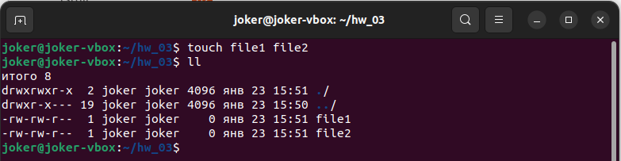

Присвоим права доступа на file1 - чтение и запись для владельца и группы, только чтение — для остальных

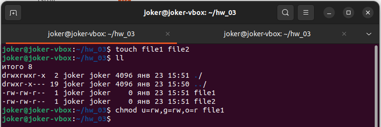

Права доступа на файл file2 права на чтение и запись только для владельца

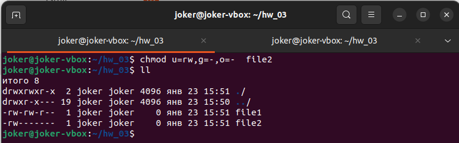

Вернем права rw для всех пользователей обоим файлам, повторим те же операции в числовом формате

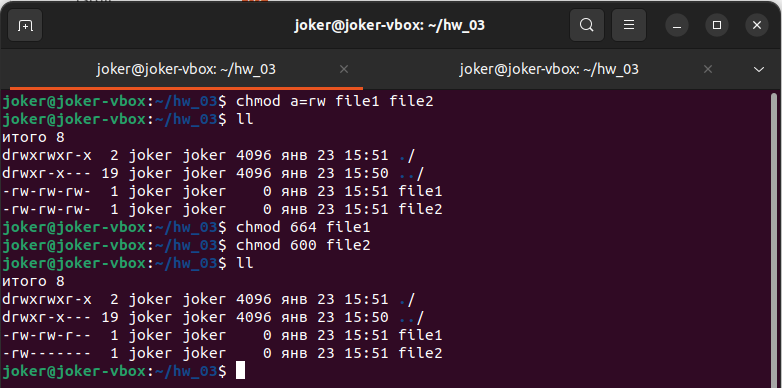

### Управление пользователями

Создание пользователя командой usesradd.

Создадим нового пользователя jok с указанием домашнего каталога, облочки и одновременным созданием одноименной группы.

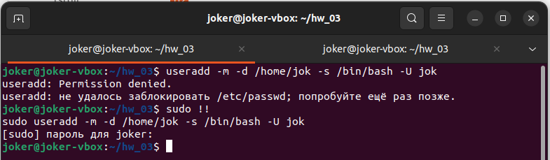

Создадим пользователя jok2 при помощи adduser

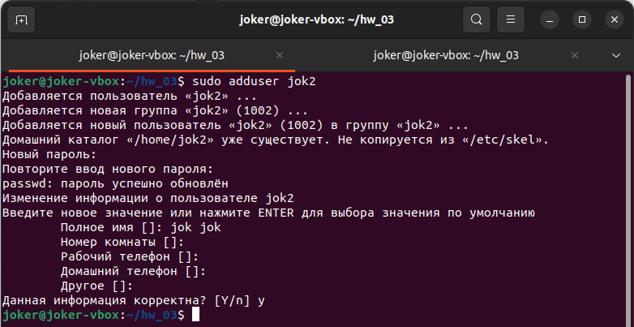

Просмотрим информацию о пользователях

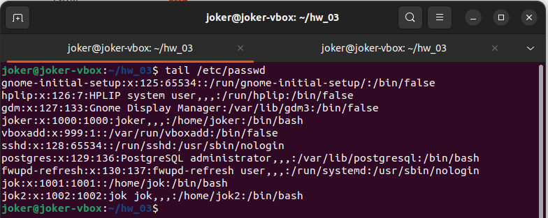

Удалим пользователя jok2

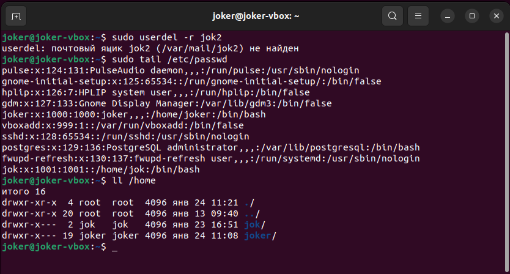

Создадим группы пользователей group1 и group2

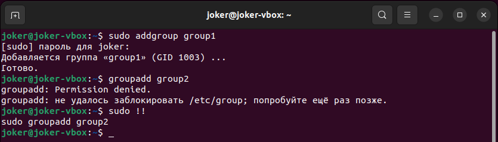

отобразим список последних созданных групп в системе

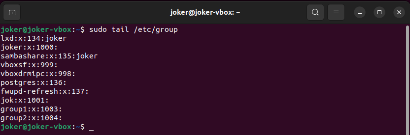

Добавим пользователя jok группу group1

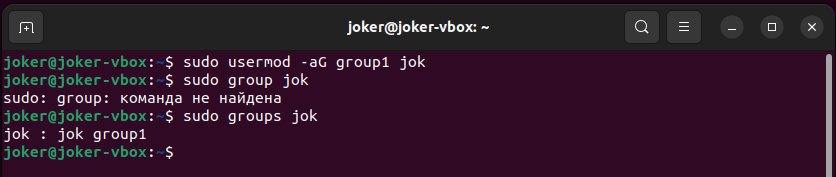

Сменим основную группу пользователю jok на group2

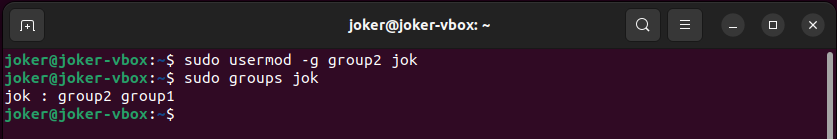

Уберем запрос пароля для sudo этого откроем для редактирования sudoers командой sudo visudo и внесем  следующие изменения для группы sudo

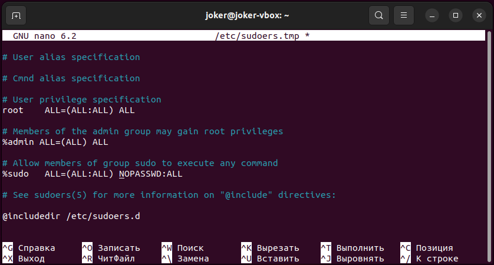

### Дополнительно

Пользователю jok дадим права на выполнение команды groupadd
